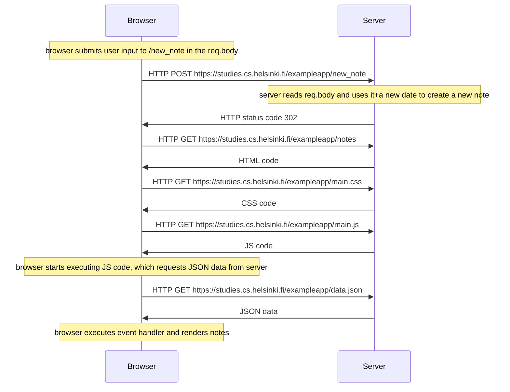
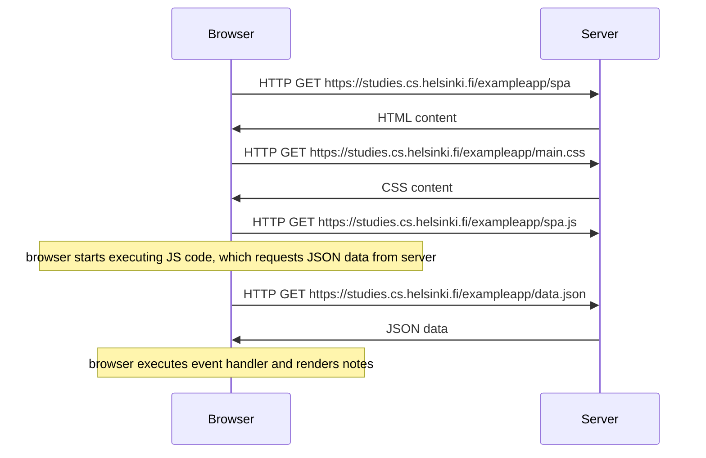
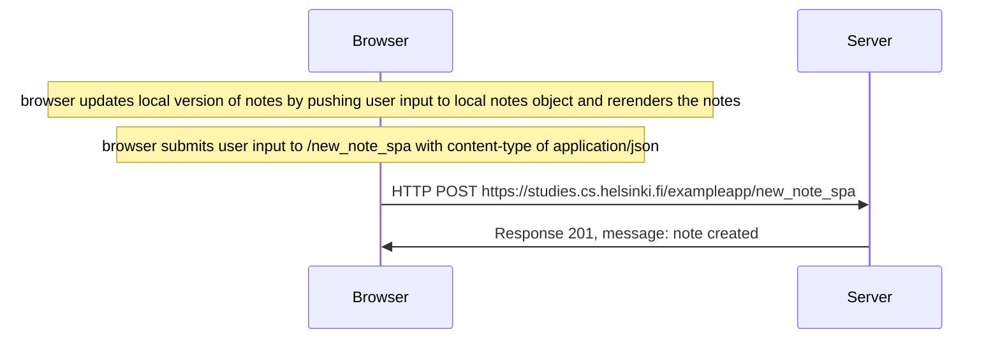

0.4: New Note

```mermaid
sequenceDiagram
Note over Browser: browser submits user input to /new_note in the req.body
Browser->>Server: HTTP POST https://studies.cs.helsinki.fi/exampleapp/new_note
Note over Server: server reads req.body and uses it+a new date to create a new note
Server->>Browser: HTTP status code 302
Browser->>Server: HTTP GET https://studies.cs.helsinki.fi/exampleapp/notes
Server->>Browser: HTML code
Browser->>Server: HTTP GET https://studies.cs.helsinki.fi/exampleapp/main.css
Server->>Browser: CSS code
Browser->>Server: HTTP GET https://studies.cs.helsinki.fi/exampleapp/main.js
Server->>Browser: JS code
Note over Browser: browser starts executing JS code, which requests JSON data from server
Browser->>Server: HTTP GET https://studies.cs.helsinki.fi/exampleapp/data.json
Server->>Browser: JSON data
Note over Browser: browser executes event handler and renders notes
```

0.5: Single page app

```mermaid
sequenceDiagram
Browser->>Server: HTTP GET https://studies.cs.helsinki.fi/exampleapp/spa
Server->>Browser: HTML content
Browser->>Server: HTTP GET https://studies.cs.helsinki.fi/exampleapp/main.css
Server->>Browser: CSS content
Browser->>Server: HTTP GET https://studies.cs.helsinki.fi/exampleapp/spa.js
Note over Browser: browser starts executing JS code, which requests JSON data from server
Browser->>Server: HTTP GET https://studies.cs.helsinki.fi/exampleapp/data.json
Server->>Browser: JSON data
Note over Browser: browser executes event handler and renders notes
```

0.6: New Note

```mermaid
sequenceDiagram
Note over Browser: browser updates local version of notes by pushing user input to local notes object and rerenders the notes
Note over Browser: browser submits user input to /new_note_spa with content-type of application/json
Browser->>Server: HTTP POST https://studies.cs.helsinki.fi/exampleapp/new_note_spa
Server->>Browser: Response 201, message: note created


```